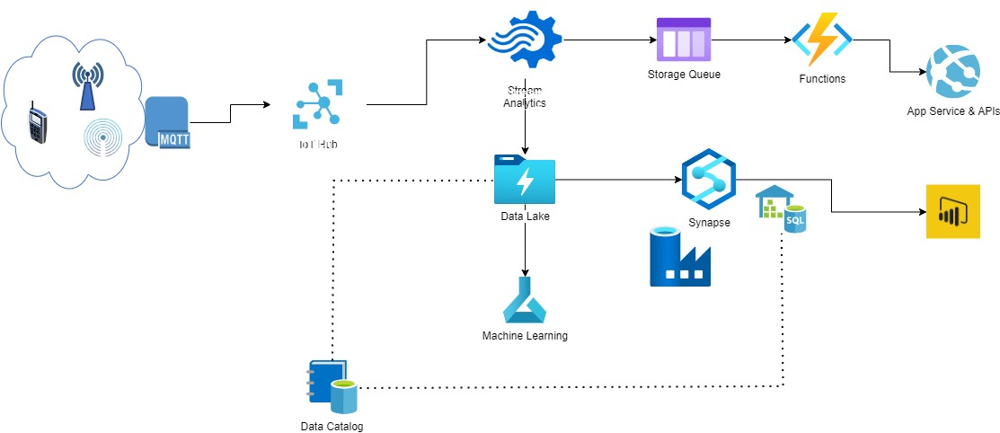

# Data Engineer - Challenge

## Intro

Axpo's infrastructure generates lots of data. Our goal is to make use of this
data to improve our decision base.

To do so we need you to collect, store and prepare data for BI specialists
and Data Scientists.

## Your mission, should you choose to accept it:

### Initial position

* List of Sensors (see iot_data_generator/sensors.json)
* Docker compose environment containing
    * IoT data generator (python, docker)
    * MQTT Broker

### Rule set

* **Please invest no more than 5 to 8 hours.** If you cannot complete the task
  in this time frame, document where you got stuck, so we can use this as a
  basis for discussion for your next interview.
f* You're free to choose the tech stack you feel fitting
* You're allowed to change existing code to suit the purpose
* If you cant solve a problem you can also skip or simulate it and describe your
  thoughts.

### Part One: Coding Challenge

We want to see your coding skills. Implement the following 2-3 steps and
extend the docker compose environment, so we can run your solution using
```docker compose up -d```.

#### Step 1:

The first goal is to collect and store the IoT data as well as the corresponding
sensors in raw format to a low cost long term storage.

#### Anwser:
The solution approximation is found in the "iot_data_processor" service. The mission of this service is to collect MQTT IoT messages and persist them in a low-cost, long-term storage with some level of organization (directory structure) and accessibility for the following phases of processing and transformation.

#### Step 2:

The second goal is to make the data available so BI specialists can query
historical data until current point in time (near real time) for different
sensors.

 #### Anwser:
 The purpose of the "iot_kafka_producer" service is to receive MQTT IoT messages as they arrive and send them to a Kafka stream (asynchronously for greater efficiency and performance), so that the data can be consumed near real time. For this, another service would be needed that performs this streaming processing and makes it available to BI specialists according to the required architecture (either a hot storage for pre-processing and/or directly in an analytical warehouse). But, it's not working properly yet :( It'seem Kafka start working well but but there must be a network problem with the "kafka producer" service that I have not been able to solve because it cannot connect to the server to be able to publish messages.

#### Step 3 (optional, if there is still time after Part Two):

Implement one of the following features:

* resample IoT data to 1 min mean values
* data catalogue for customers
* data quality indicator
  
 #### Anwser:
 The solution for the 1st and 2nd point can be found in the notebook "data_quality/check_quality.ipynb".

### Part Two: Solution Design

Imagine you're not bound to local development, so you could use whatever
services and products are out there.

* How would you solve the problem stated in Part One now?
  
Design you favorite solution to solve the problem. There is no need for any
code in this part. Just write down your thoughts and arguments in a technical
draft. Don't lose time over-engineering or over-designing it.

May the following questions help you:

* How would your favorite architecture look like?
* What technologies and services would you use?
* How would you deploy the required infrastructure?
* How would you monitor your data pipelines?
* How would you monitor and improve data quality?
* How would you communicate with customers consuming the data?
* ...

## Solution Overview:
The problem we are addressing is the processing of IoT data in near real-time, ensuring reliable ingestion, processing, and storage. In this technical draft, I will outline a solution using Azure services to meet the requirements and provide a scalable and reliable architecture:

1. Ingestion Process:
    - IoT devices send telemetry data to Azure IoT Hub by using AMQP or MQTT broker/Gateway.
Or a microservice that subscribes to the MQTT broker/Gateway, receives IoT data messages, and send it to Azue IoT hub
    - Azure IoT Hub serves as the entry point for communication and manage with IoT devices.
    - IoT Hub routes incoming messages to Azure Stream Analytics for near real-time processing.

2. Data Storage:
    - Cold path:
        - Azure Data Lake Storage receives data from Stream Analytics outputs for long term storage (Raw data / Bronze Zone). Storing the raw data allows for data recovery, historical analysis, and reprocessing in case of any processing failures or updates to data processing logic.
    - Hot path:
        - If necessary, the processed data can be persisted in Azure Cosmos DB for efficient querying and analysis, e.g: from Web Apps/APIs. For this:
            - Astorage Service Bus Queue could be help to process in proper way the data and
            - Azure Functions can further process the data, perform additional business logic to consume data from the queue instantly without bottlenecks and make it available to other services.
        - Its also possible to go direclty to the “Service Data level” to display near real-time insights, e.g.: using Stream Analytics output to Power BI.

3. Data Processing:
    - Depending on the complexity and volume of data, a separate service like Azure Synapse Analytics or Apache Spark Integration can be implemented to perform data processing tasks over the stored raw data. This service can be responsible for reading the raw data from storage, applying transformations, aggregations, or any other required data processing operations (Staging data / Silver Zone).
    - This integration enables efficient data processing and eliminates the need for data movement or duplication.
    - Processed data can be stored in Azure Synapse Analytics leveraging Data Warehousing capabilities (Curated data / Gold Zone)
      
4. Data Service:
    - Power BI connects with Azure Synapse Analytics or Azure SQL databases to create interactive dashboards and reports gain insights from the processed data.
    - Also, data products can be created from the processed and enriched data to be consumed by end users through other applications (e.g.: customer Web Portal, other operational systems, etc.).

### Considerations:

1. Deployment of Infrastructure:
- To deploy the required infrastructure, you can leverage Infrastructure-as-Code tools such as Azure Resource Manager (ARM) templates or Terraform to define and deploy the infrastructure components in a repeatable and automated manner. 

2. Monitoring and Alerting: 
    - It will  be necessary to include logging throughout the pipeline to be able to identify what has happened in case of any problems.
    - To monitor data pipelines in a across way,  Azure Monitor as centralized monitoring and logging solution could be user to collect data from services including IoT Event Hubs, Functions, Synapse, etc.

3. Data Quality:
- It will be necessary to introduce hecks and validation mechanisms within the data pipelines at various stages, such as schema validation, data type validation, and data completeness checks, and take corrective actions to improve data quality dowstream.

4. Data Governance:
- Data Catalog, Metadata Management, and Data Lineage, should be considered implementing a data governance strategy according to business and organizational requriements.
In this point Azure Pure View could be an alied for:
    - Data Discovery and Cataloging createing a centralized metadata catalog that captures information about the all data assets (Data Lake, Syanapse, MongoDB, etc), their schema, lineage, and relationships.
    - Also It helps enforce data governance practices by automatically applying metadata tags, sensitivity label, etc.
- Data Lineage to a operational level should be managed implementing good practices throughout the pipeline, from the raw data stage and data transformation with their respective metadata.

5. Communication with Data Consumers:
    - It's important to establish a constant feedback loops with data consumers to understand their needs to improve the data products and service.
    - Its a must set a channel (like a Portal) to share a well-defined data catalog, provide documentation, data schemas, data dictionaries, and sample queries, data consumption guidelines, access controls, etc, to help consumers understand the available data and its structure.

6. Arqchitecture Reference:

